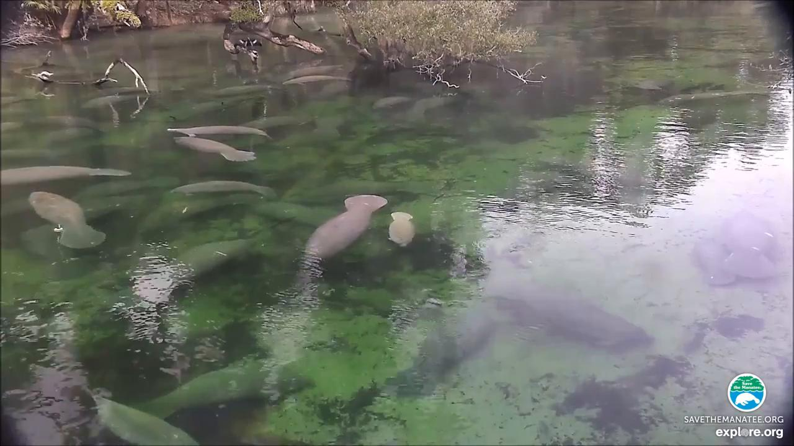
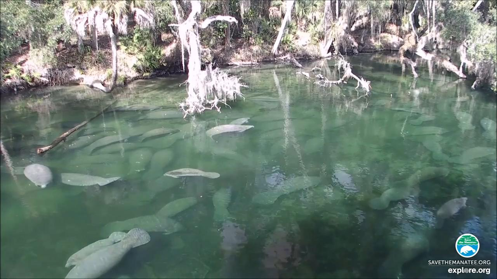

# Counting Manatee Aggregations using Deep Neural Networks and Anisotropic Gaussian Kernel

# Abstract
Manatees are aquatic mammals with voracious appetites. They rely on sea grass as the main food source, and often spend up to eight hours a day grazing. They move slow and frequently stay in group (i.e. aggregations) in shallow water to search for food, making them vulnerable to environment change and other risks. Accurate counting manatee aggregations within a region is not only biologically meaningful in observing their habit, but also crucial for designing safety rules for human boaters, divers, etc., as well as scheduling nursing, intervention, and other plans. In this paper, we propose a deep learning based crowd counting approach to automatically count number of manatees within a region, by using low quality images as input. Because manatees have unique shape and they often stay in shallow water in groups, water surface reflection, occlusion, camouflage etc. making it difficult to accurately count manatee numbers. To address the challenges, we propose to use Anisotropic Gaussian Kernel (AGK), with tunable rotation and variances, to ensure that density functions can maximally capture shapes of individual manatees in different aggregations. After that, we apply AGK kernel to different types of deep neural networks primarily designed for crowd counting, including VGG, SANet, Congested Scene Recognition network (CSRNet), MARUNet etc. to learn manatee densities and calculate number of manatees in the scene. By using generic low quality images extracted from surveillance videos, our experiment results and comparison show that AGK kernel based manatee counting achieves minimum Mean Absolute Error (MAE) and Root Mean Square Error (RMSE). The proposed method works particularly well for counting manatee aggregations in environments with complex background. 

## Source Images
#### Source video 
[Save the Manatee](https://www.savethemanatee.org/manatees/manatee-webcams/10/16) provides on underwater and above water webcames for watching manatees as well as some video clips. You can download the video we used in this project from [Blue Spring Manatee Webcam Highlights - Above Water (3)](https://www.youtube.com/watch?v=KEIDm1S8qmk&t=2676s) and you can also download the video from [Google Drive](https://drive.google.com/drive/folders/1_VNmEzw0PDOJD07m4ApQ-Zcov_wHcp92?usp=sharing)

#### Generate images 
Once the video has been downloaded, move it into the folder `src/image_generator`, run this script to generate images from the video

`python extract_frames_moviepy.py $video_name$.mp4` (`moviepy` is required to run the script)

A folder named `$video_name$-moviepy` will be generated at the same folder and all the images will be placed in that folder.

#### Images samples generated from the video

  
   
  

#### Remove duplicated images
* **Extract images features** 

	go into `src/drop_images` folder and run  
  `python extract_features.py $your_image_folder$` 
  
  By running this command, for each of the image in the folder, its features are extracted from the image and saved into a `.pickle` file which has the same name with the image. These `.pickle` files are saved in the new folder of `feature_data` which is a subfolder where your run the command.
  
* **Calculate the distance of the images**

  `python feature_distance_calculations.py ${path_to}$/feature_data`
  
  By running this command, it will calculate the distance among each of the images and the results are saved into a subfolder of the feature data folder, `$path_to$/feature_data/distance_results/distance.pickle`.
  
  
 * **Choose images**
   
    As all the distances among all the images have been calculated, a threshold value can be used to determine weather images should be kept or not.

## Labeling Work
In order to label the images, we employee the tool [Crowd Counting Labeler](https://github.com/Elin24/cclabeler/blob/master/README_en_US.md) and modified part of the code to support line labeling work.

The newly program is also attached in this project in the folder of `/src/cclabeler_line`. For the usage of this tool, please check their [guidance from here](https://github.com/Elin24/cclabeler/blob/master/README_en_US.md)
