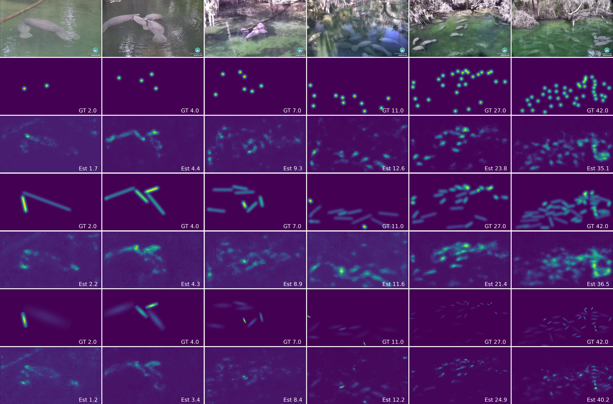

# Counting Manatee Aggregations with Deep Learning 🚀

This repository is the official implementation of our research work titled ["Counting Manatee Aggregations using Deep Neural Networks and Anisotropic Gaussian Kernel"](https://rdcu.be/dq0Dr) by Zhiqiang Wang, Yiran Pang, Cihan Ulus, and Xingquan Zhu.

## About The Project

In our groundbreaking study, we delve into the fascinating world of manatees and explore innovative techniques for counting these majestic sea creatures. Our method harnesses the power of Anisotropic Gaussian Kernels integrated with Deep Neural Networks, which has proven its mettle by outperforming various benchmarks.

### Key Highlights:

- **Innovative Application:** First-of-its-kind approach using Anisotropic Gaussian Kernels for aquatic animal aggregation.
- **Extensive Testing:** Rigorous evaluation across different neural network architectures.
- **Impressive Results:** Demonstrated superior performance in counting not just manatees but also wheat heads, showcasing the technique's versatility.


## Results


Examples of algorithm performance with respect to different manatee densities in the scene.


## Dataset

You can download the video we used in this project from [Blue Spring Manatee Webcam Highlights - Above Water (3)](https://www.youtube.com/watch?v=KEIDm1S8qmk&t=2676s) and you can also download the video from [Google Drive](https://drive.google.com/drive/folders/1_VNmEzw0PDOJD07m4ApQ-Zcov_wHcp92?usp=sharing)

Download the images and labels from [dataset.zip](https://drive.google.com/drive/folders/1_VNmEzw0PDOJD07m4ApQ-Zcov_wHcp92).
It contains two folders, `images` and `labels`. The `images` folder includes all the images and the labels contains a list of JSON file. For each of the image that it has a corresponding JSON file whose name is the same as the image.

For example
<p float="left">
  
</p>

```
{"img_id": "above0-00-00.jpg", "human_num": 8, "boxes": [{"sx": 740.8, "sy": 362.88, "ex": 887.6800000000001, "ey": 334.08000000000004}, {"sx": 496.0, "sy": 331.2, "ex": 775.36, "ey": 325.44}, {"sx": 519.0400000000001, "sy": 192.96, "ex": 710.56, "ey": 220.32}, {"sx": 290.08000000000004, "sy": 254.88, "ex": 645.76, "ey": 246.24}, {"sx": 2.0800000000000183, "sy": 277.92, "ex": 284.32000000000005, "ey": 236.16}, {"sx": 71.20000000000002, "sy": 308.15999999999997, "ex": 344.80000000000007, "ey": 283.68}, {"sx": 382.24, "sy": 355.68, "ex": 19.360000000000017, "ey": 358.56}, {"sx": 262.72, "sy": 328.32, "ex": 111.52000000000001, "ey": 348.48}], "points": []}
```

The Json file contains the image name, `img_id`, the number of manatees within the images, `human_num`, and the start point,`(sx, xy)` and end point, `(ex, ey)`, for each of the line label,`boxes`(the key is inhereted from CCLabeler for boxing labeling).

## Run the program
### Easy Demo

If you are only interested in running the program, download or clone this project directly and go into the folder of `src/trainer` and then run

```
python3 train_networks debug
```

This command runs all 3 types of density maps over 4 different networks, CSRNET, MCNN, SANET and VGG.


### To Train the NNs fully
* **Generate density maps**

 Current `dataset` folder only provides examples and shows how it looks like. I do not have enough storage in Google Drive to save generated density maps. You have to generate the density maps by youself which may takes about 5-10 minutes.

 * Download dataset from [Google Drive](https://drive.google.com/drive/folders/1_VNmEzw0PDOJD07m4ApQ-Zcov_wHcp92)
 * Unzip `dataset.zip` file to replace the current `dataset` folder

 Now, within the `dataset` folder, you should have all images and labels.

 Please run the following script to generate the three types of density map

 ```
 cd src/densitymap_generator
 python make_dataset.py
 ```

 The final directory structure should be the same as current one.

 Once you have finished the density map generation, run the following command to start training and validation

 ```
 cd src/trainer
 python3 train_networks debug
 ```


## Details to setup the program step by step
You can refer to [DETAILS_README](DETAILS_README.md) for more details about how to generate images, calculate their distances, drop images etc.

## Cite our work
If you find our research useful, please consider citing our work using the following Bibtex entry:

```
@article{wang2023counting,
  title={Counting manatee aggregations using deep neural networks and Anisotropic Gaussian Kernel},
  author={Wang, Zhiqiang and Pang, Yiran and Ulus, Cihan and Zhu, Xingquan},
  journal={Scientific Reports},
  volume={13},
  number={1},
  pages={19793},
  year={2023},
  publisher={Nature Publishing Group UK London}
}
```