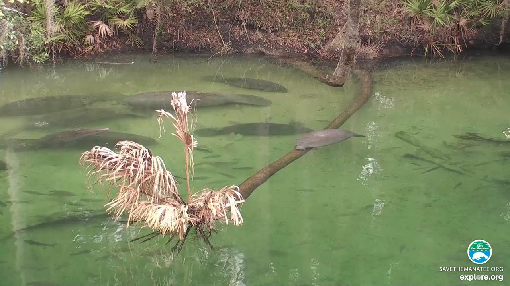

# Counting Manatee Aggregations using Deep Neural Networks and Anisotropic Gaussian Kernel


# Abstract
Manatees are aquatic mammals with voracious appetites. They rely on sea grass as the main food source, and often spend up to eight hours a day grazing. They move slow and frequently stay in group (i.e. aggregations) in shallow water to search for food, making them vulnerable to environment change and other risks. Accurate counting manatee aggregations within a region is not only biologically meaningful in observing their habit, but also crucial for designing safety rules for human boaters, divers, etc., as well as scheduling nursing, intervention, and other plans. In this paper, we propose a deep learning based crowd counting approach to automatically count number of manatees within a region, by using low quality images as input. Because manatees have unique shape and they often stay in shallow water in groups, water surface reflection, occlusion, camouflage etc. making it difficult to accurately count manatee numbers. To address the challenges, we propose to use Anisotropic Gaussian Kernel (AGK), with tunable rotation and variances, to ensure that density functions can maximally capture shapes of individual manatees in different aggregations. After that, we apply AGK kernel to different types of deep neural networks primarily designed for crowd counting, including VGG, SANet, Congested Scene Recognition network (CSRNet), MARUNet etc. to learn manatee densities and calculate number of manatees in the scene. By using generic low quality images extracted from surveillance videos, our experiment results and comparison show that AGK kernel based manatee counting achieves minimum Mean Absolute Error (MAE) and Root Mean Square Error (RMSE). The proposed method works particularly well for counting manatee aggregations in environments with complex background. 


## Dataset

You can download the video we used in this project from [Blue Spring Manatee Webcam Highlights - Above Water (3)](https://www.youtube.com/watch?v=KEIDm1S8qmk&t=2676s) and you can also download the video from [Google Drive](https://drive.google.com/drive/folders/1_VNmEzw0PDOJD07m4ApQ-Zcov_wHcp92?usp=sharing)

Download the images and labels from [dataset.zip](https://drive.google.com/drive/folders/1_VNmEzw0PDOJD07m4ApQ-Zcov_wHcp92).
It contains two folders, `images` and `labels`. The `images` folder includes all the images and the labels contains a list of JSON file. For each of the image that it has a corresponding JSON file whose name is the same as the image.

For example
<p float="left">
  
</p>

```
{"img_id": "above0-00-00.jpg", "human_num": 8, "boxes": [{"sx": 740.8, "sy": 362.88, "ex": 887.6800000000001, "ey": 334.08000000000004}, {"sx": 496.0, "sy": 331.2, "ex": 775.36, "ey": 325.44}, {"sx": 519.0400000000001, "sy": 192.96, "ex": 710.56, "ey": 220.32}, {"sx": 290.08000000000004, "sy": 254.88, "ex": 645.76, "ey": 246.24}, {"sx": 2.0800000000000183, "sy": 277.92, "ex": 284.32000000000005, "ey": 236.16}, {"sx": 71.20000000000002, "sy": 308.15999999999997, "ex": 344.80000000000007, "ey": 283.68}, {"sx": 382.24, "sy": 355.68, "ex": 19.360000000000017, "ey": 358.56}, {"sx": 262.72, "sy": 328.32, "ex": 111.52000000000001, "ey": 348.48}], "points": []}
```

The Json file contains the image name, `img_id`, the number of manatees within the images, `human_num`, and the start point,`(sx, xy)` and end point, `(ex, ey)`, for each of the line label,`boxes`(the key is inhereted from CCLabeler for boxing labeling).

## Run the program
### Generate density maps

Current `dataset` folder only provides examples and shows how it looks like. I do not have enough storage in Google Drive to save generated density maps. You have to generate the density maps by youself which may takes about 5-10 minutes.

* Download dataset from [Google Drive](https://drive.google.com/drive/folders/1_VNmEzw0PDOJD07m4ApQ-Zcov_wHcp92)
* Unzip `dataset.zip` file to replace the current `dataset` folder

In the dataset, it includes all the images and labels. However, I do not have enough storage in Google drive to upload the density maps. You have to generate the density maps by youself which may takes about 5-10 minutes.

Please run the following script to generate the three types of density map

```
cd src/densitymap_generator
python make_dataset.py
```

The final directory structure should be the same as current one.


TODO:
2. Train with different CNNs


## Details to setup the program step by step
You can refer to another [DETAILS_README](DETAILS_README.md) for more details about how to generate images, calculate their distances, drop images ete.